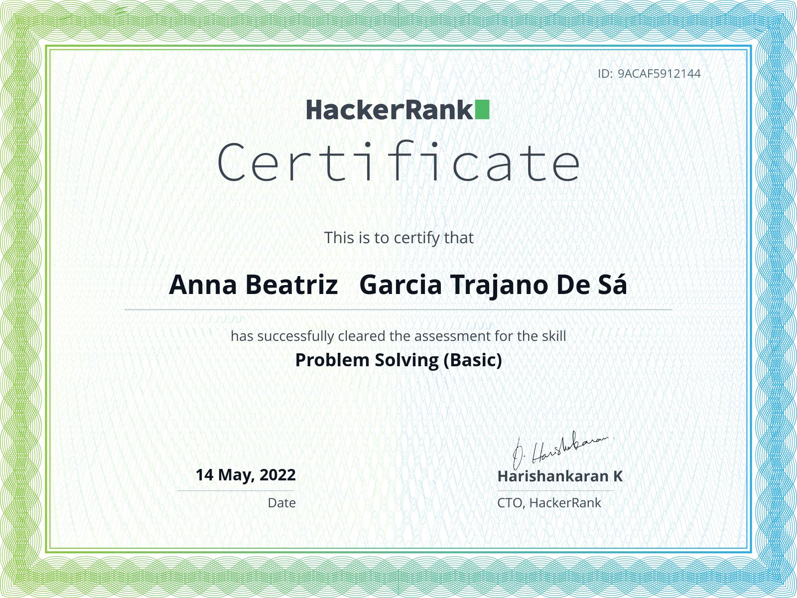

Este repositório contém os exercicios realizados por _[Anna Beatriz Garcia Trajano de Sá](www.linkedin.com/in/anna-beatriz-trajano-de-sá)_ enquanto estudava na [Trybe](https://www.betrybe.com/) :rocket:

# Exercícios de Lógica de Programação: Rumo a Gold Badge (HackerRank - Problem Solving) ⭐

Exercícios destinados a aprimorar conceitos de Algoritimos, Lógica de Progamação e JavaScript. 
Como base tive como inspiração a série do canal Tecnologia em Video (Gustavo Caetano) e os exercícios do HackerRank.

## Gold Badge Conquistada!

## Certificados

Certificate             |         
:-------------------------:|
  |

## Habilidades Desenvolvidas

Nestes exercícios, aprimorei as seguintes habilidades:

 - Algoritmos;
 - Lógica de Programação;
 - JavaScript,

 
 ## Referências
 [Lógica de Programação - Tecnologia em Vídeo](https://youtube.com/playlist?list=PLylCwvNCtoakuEW0VGSD8XB56jBHbQxF8) 
 [HackerRank](https://www.hackerrank.com) 
 [Lógica de Programação e Algoritmos com JavaScript: uma Introdução à Programação de Computadores com Exemplos e Exercícios Para Iniciantes](https://www.amazon.com.br/L%C3%B3gica-Programa%C3%A7%C3%A3o-Algoritmos-com-JavaScript/dp/6586057906/ref=asc_df_6586057906/?tag=googleshopp00-20&linkCode=df0&hvadid=581934698281&hvpos=&hvnetw=g&hvrand=11552060094739945854&hvpone=&hvptwo=&hvqmt=&hvdev=c&hvdvcmdl=&hvlocint=&hvlocphy=1001650&hvtargid=pla-1646193652318&psc=1) 
